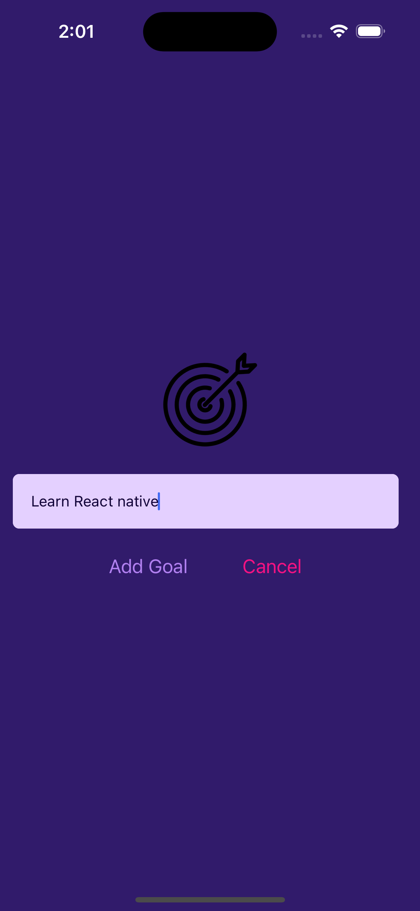
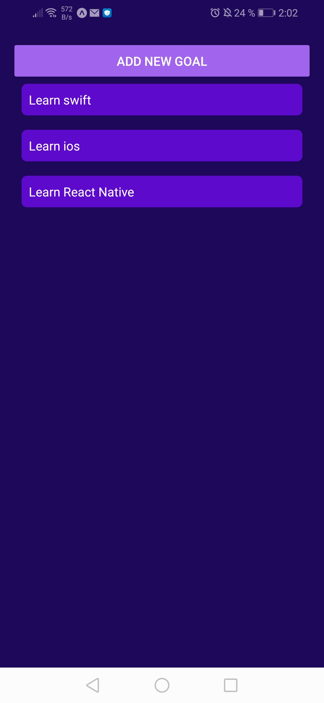
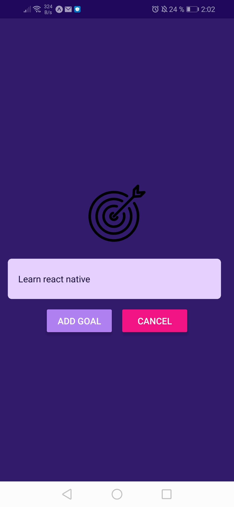

# Apps con ReactNative
# EJ1 : Lista de objetivos 
Se usa un FlatList para ver todos los items y efecto ripple al tocar los elemntos y eliminarlos. Para plataformas ios y android.

**En iOS** 

  
  

**En Android**

  
  

